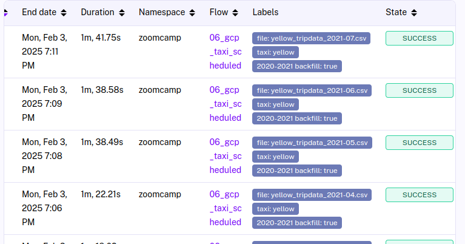
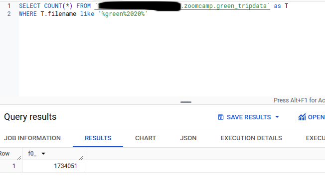
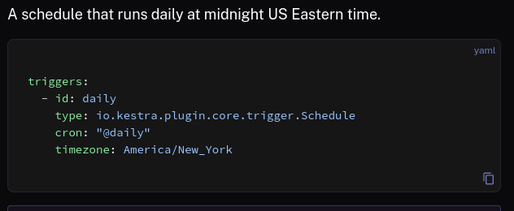

# Homework 1

## Proof of running the backfills
 -  

## Question 1
 - Checking the output of the extract function in kestra its 134.5mb

## Question 2
 - green_tripdata_2020-04.csv

## Question 3
 - 

## Question 4
 - 

## Question 5
 - 

## Question 6
 - From kestras docs 
 
