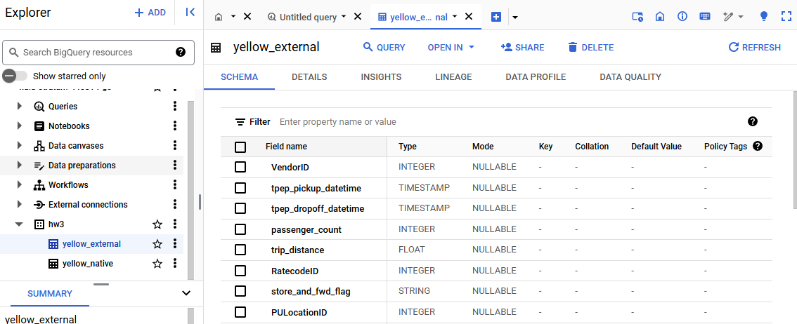
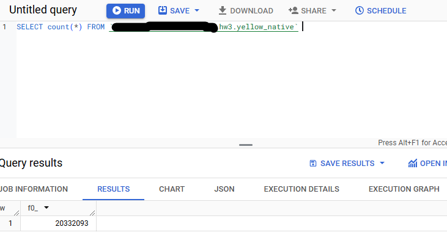
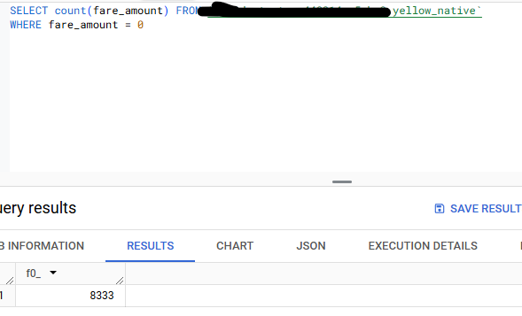
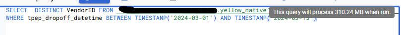

# Homework 1

## Proof of creating the datasets on bq
 - 

## Question 1
 - 

## Question 2
 - 
 - 
 - 0 MB for the External Table and 155.12 MB for the Materialized Table

## Question 3
 - BigQuery is a columnar database, and it only scans the specific columns requested in the query. Querying two columns (PULocationID, DOLocationID) requires reading more data than querying one column (PULocationID), leading to a higher estimated number of bytes processed.

## Question 4
 - 
 - 8,333

## Question 5
 - Partition by tpep_dropoff_datetime and Cluster on VendorID
 - 

## Question 6
 - 
 
 - 310.24 MB for non-partitioned table and 26.84 MB for the partitioned table

## Question 7
 - GCP Bucket

## Question 8
 - False 

## Question 9
 - estimates 0 bytes read, because bigquery reads metadata in this case and not the actual data. This makes sense because when you first create the table you can get the number of records in the metadata, and count(*) without any other mutations wont affect the number of rows.

